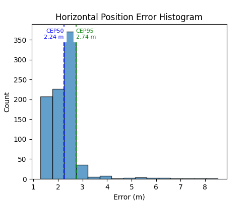
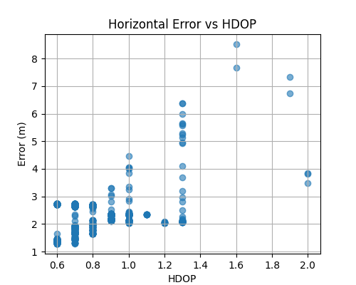
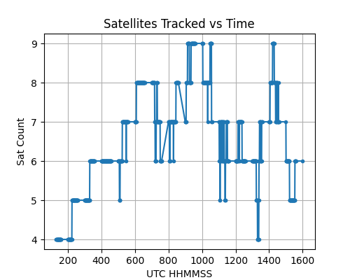
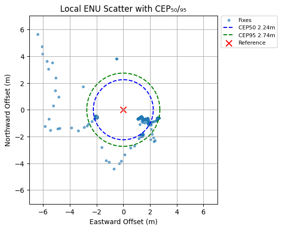

<p align="center">
  
</p>

<h1 align="center">GNSS Logger & Analysis Toolkit</h1>

<p align="center">
  <strong>Automated GNSS testing, logging, and performance analysis suite</strong>
</p>

<p align="center">
  
  
  
  
</p>

---

A comprehensive **Python** suite for automated GNSS testing, logging, and performance analysis. Designed for Telit-based modules with standard NMEA output, this toolkit provides:

- **`gnss_logger.py`**  
  Resets & powers-on the GNSS engine, enables NMEA output, and captures raw NMEA sentences to file.  
  **Key functions** inside:
  - `send_reset(mode)` — sends cold/warm/hot reset via AT command  
  - `enable_nmea()` — configures which NMEA sentences to output  
  - `capture_nmea(duration, output_file)` — logs incoming NMEA lines for the specified time  

- **`gnss_nmea_analysis.py`**  
  Parses a saved NMEA log, computes TTFF, CEP₅₀/₉₅, RMS error, and generates standard plots.  
  **Key functions** inside:
  - `parse_nmea(nmea_file)` — extracts time, fix quality, lat/lon, HDOP, satellite count  
  - `haversine(lat1, lon1, lat2, lon2)` — computes great-circle distance  
  - `main()` (CLI entry point) — handles arguments, computes metrics, writes CSV + PNGs  

---

## 📋 Table of Contents

- [GNSS Logger \& Analysis Toolkit](#gnss-logger--analysis-toolkit)
  - [📋 Table of Contents](#-table-of-contents)
  - [📋 Prerequisites](#-prerequisites)
  - [🔧 Installation](#-installation)
  - [🛠 Usage](#-usage)
    - [1. GNSS Logger (`gnss_logger.py`)](#1-gnss-logger-gnss_loggerpy)
      - [Console Output](#console-output)
      - [Output](#output)
    - [2. NMEA Analysis (`gnss_nmea_analysis.py`)](#2-nmea-analysis-gnss_nmea_analysispy)
      - [Generated Files (same folder as `--nmea-file`)](#generated-files-same-folder-as---nmea-file)
  - [📊 Example Outputs](#-example-outputs)
    - [3. Analysis GUI (`gnss_analysis_gui`)](#3-analysis-gui-gnss_analysis_gui)
    - [Outputs (saved alongside your NMEA log file)](#outputs-saved-alongside-your-nmea-log-file)
  - [📈 Metrics \& Plots](#-metrics--plots)
  - [⚙️ Customization](#️-customization)
  - [⚖️ License](#️-license)

---

## 📋 Prerequisites

- **Python 3.7+**  
- **pip** (Python package manager)  
- **Tkinter** (for GUI):
  - **Linux**:  
    ```bash
    sudo apt-get install python3-tk
    ```

---

## 🔧 Installation

1. **Clone the repository**
   ```bash
   git clone https://github.com/RFingAdam/gnss-toolkit
   cd gnss-toolkit
``

2. **Install dependencies**

   ```bash
   pip install pyserial pandas numpy matplotlib
   ```

---

## 🛠 Usage

### 1. GNSS Logger (`gnss_logger.py`)

Capture raw NMEA sentences from a Telit GNSS module:

```bash
python gnss_logger.py <COM_PORT> [--mode MODE] [--duration SECONDS] [--output FILE]
```

| Option        | Description                                                     |
|---------------|-----------------------------------------------------------------|
| `<COM_PORT>`  | Serial port, e.g. `COM4` (Windows) or `/dev/ttyUSB0` (Linux/macOS) |
| `--mode`      | GNSS start mode: `cold` (default), `warm`, or `hot`             |
| `--duration`  | Logging duration in seconds (default: `900`)                    |
| `--output`    | Output filename for the NMEA log (default: `nmea_capture.txt`)  |

#### Console Output
- AT command responses & `OK` messages  
- `# START HHMMSS` header marking session timestamp  
- 🎯 First-fix notification  
- Live NMEA sentences streamed to console  

#### Output
- Raw NMEA log file containing only NMEA sentences (plus the header)  

---

### 2. NMEA Analysis (`gnss_nmea_analysis.py`)

Parse an NMEA log, compute performance metrics, and generate plots:

```bash
python gnss_nmea_analysis.py \
  --nmea-file path/to/nmea_capture.txt \
  --start-time HHMMSS \
  --ref-lat <latitude> \
  --ref-lon <longitude>
```

| Parameter           | Description                                              |
|---------------------|----------------------------------------------------------|
| `--nmea-file`       | Path to the NMEA log (produced by `gnss_logger.py`)      |
| `--start-time`      | GNSS start time in UTC (format `HHMMSS`)                 |
| `--ref-lat`, `--ref-lon` | Reference coordinates (decimal degrees)               |

#### Generated Files (same folder as `--nmea-file`)
| Filename                    | Description                                            |
|-----------------------------|--------------------------------------------------------|
| `<basename>_summary.csv`    | CSV summary of TTFF, CEP₅₀/₉₅, RMS, and fix count      |
| `error_histogram.png`       | Error distribution histogram with CEP₅₀/₉₅ markers     |
| `scatter_with_cep.png`      | ENU scatter plot of fixes with CEP₅₀/₉₅ circles       |
| `error_vs_hdop.png`         | Scatter of HDOP vs. horizontal error                  |
| `sats_vs_time.png`          | Plot of satellite count vs. UTC time                  |
| `summary_notes.txt`         | Plaintext report containing all metrics and samples   |

## 📊 Example Outputs

Below are sample results generated by `gnss_nmea_analysis.py` / the GUI:

<div align="center">
  
  
</div>

<div align="center">
  
  
</div>

---

### 3. Analysis GUI (`gnss_analysis_gui`)

Tkinter GUI wrapping the same analysis logic with summary export:

1. **Browse…** to select your NMEA log file  
2. **Enter Start Time (HHMMSS)** (e.g. `192841`)  
3. **Enter Reference Latitude & Longitude** (decimal degrees)  
4. **Click Run Analysis**  

---

### Outputs (saved alongside your NMEA log file)

| Filename               | Description                                             |
|------------------------|---------------------------------------------------------|
| `summary_notes.txt`    | Plaintext report of TTFF, CEP₅₀/₉₅, RMS, sample fixes    |
| `error_histogram.png`  | Histogram of horizontal errors with CEP markers         |
| `scatter_with_cep.png` | ENU scatter plot with CEP₅₀/₉₅ circles                 |
| `error_vs_hdop.png`    | Scatter of HDOP vs. horizontal error                    |
| `sats_vs_time.png`     | Plot of satellite count vs. UTC time                    |

---

## 📈 Metrics & Plots

| Metric               | Description                                            |
|----------------------|--------------------------------------------------------|
| **TTFF (s)**         | Time‐to‐first‐fix after GNSS power‐on                 |
| **CEP₅₀ / CEP₉₅ (m)** | Radii containing 50 % / 95 % of horizontal fixes       |
| **RMS Error (m)**    | Root‐mean‐square of horizontal errors                  |
| **Error Histogram**  | Distribution of horizontal errors with CEP₅₀/₉₅ lines  |
| **ENU Scatter**      | East/North offsets (m) with CEP₅₀/₉₅ rings             |
| **HDOP vs Error**    | Relationship between HDOP values and observed error    |
| **Satellites vs Time** | Number of tracked satellites throughout the session  |

---

## ⚙️ Customization

- Tweak histogram **bins** or styling  
- Add support for additional NMEA sentences (e.g. GSA, RMC)  
- Modify CLI flags (logging **duration**, **mode**, output paths)  
- Extend analysis with new metrics (e.g. HDOP time-series)

---

## ⚖️ License

Licensed under the **GNU GPL v3.0**. See [LICENSE](LICENSE) for details.

